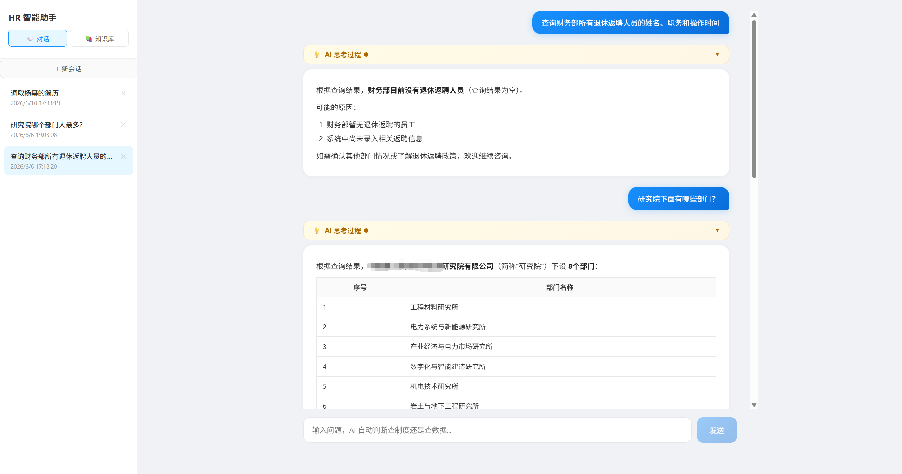
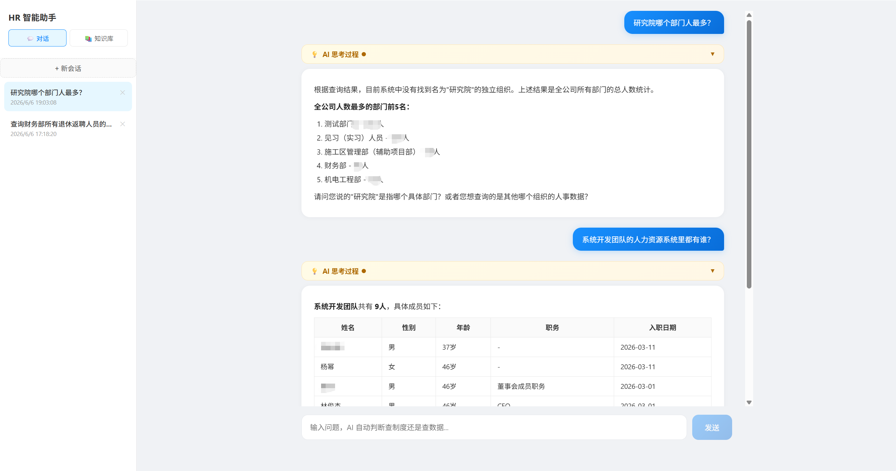
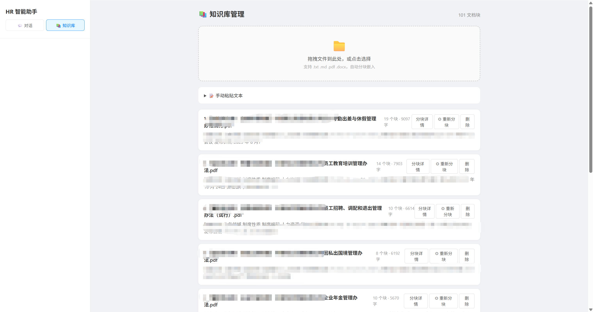
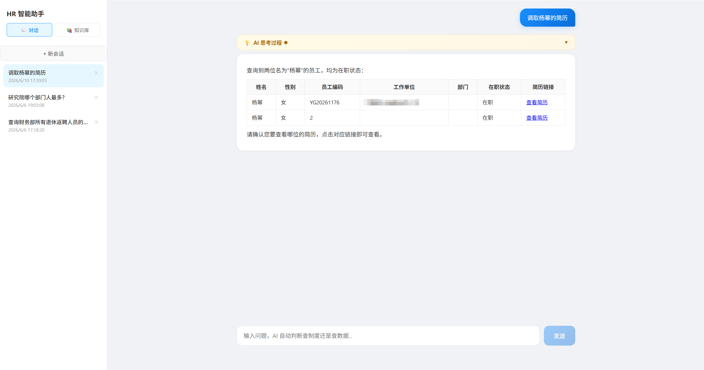

# HR 智能助手 (HR Intelligent Assistant)

基于 **LangChain + LangGraph + Function Calling + ChromaDB RAG** 的企业人力资源 AI 助手。单一对话入口，AI 自动识别意图并调用对应工具（数据查询 / 制度问答 / 简历解析 / 流程引导），支持知识库可视化管理与多智能体编排。

---

## Features

### 对话能力
- **🧠 统一对话入口** — 一个输入框搞定所有场景，AI 自动判断查制度还是查数据
- **📊 Text-to-SQL 数据查询** — Function Calling 双工具 Agent（人事库/薪酬库），自然语言 → SQL → 实时结果
- **💬 HR 制度 RAG 问答** — ChromaDB 向量检索 + BGE-M3 嵌入 + BGE-Reranker-V2-M3 重排序
- **📄 简历智能解析** — 结构化提取候选人信息（姓名/学历/经验/技能/期望薪资）
- **🚪 入转调离引导** — 入职/转正/离职/退休流程 AI 逐步引导
- **⚡ SSE 流式输出** — 实时推送，思考过程（工具调用/检索结果）可视化
- **🧠 会话记忆** — 多轮对话上下文保持，左侧栏会话管理
- **💾 会话持久化** — localStorage 自动保存，刷新不丢失

### 知识库管理
- **📁 文件上传** — 拖拽上传 txt/md/pdf/docx，自动分块、嵌入、索引
- **📝 文本粘贴** — 手动粘贴制度文本入库
- **📊 来源管理** — 按文件名分组，查看块数/字数/预览
- **🔍 分块详情** — 展开查看每个块的完整内容，支持单块删除
- **⚙ 重新分块** — 可调节 chunk_size 和 overlap 重新分块
- **🔄 混合检索** — N-gram 关键词路由 + 语义评分 + Reranker 精排

---

## 系统截图

### 统一对话 — 智能问答




### 知识库管理



### 干部简历查询


---

## Tech Stack

| 层级 | 技术 |
|------|------|
| LLM | minimax-m2.5 (OpenAI-compatible API) |
| 框架 | LangChain 1.3 + LangGraph 1.2 |
| 后端 | FastAPI + Uvicorn (Python 3.11) |
| 前端 | Vue 3 + Vite + marked (Markdown 渲染) |
| 数据库 | MySQL (人事库 + 薪酬库，pymysql) |
| 向量库 | ChromaDB |
| 嵌入 | BGE-M3 (1024-dim, OpenAI-compatible API) |
| 重排序 | BGE-Reranker-V2-M3 |
| 流式 | SSE (Server-Sent Events) |
| Agent | Function Calling (5 工具) + Supervisor 多智能体模式 |

---

## Architecture

```
┌──────────┬──────────────────────────────────────────┐
│  会话管理   │            统一对话界面                    │
│ (侧边栏)   │  ┌──────────────────────────────────┐   │
│          │  │     Supervisor Agent (多智能体)     │   │
│ + 新会话  │  ├────┬────┬────┬────┬───────────────┤   │
│          │  │ DB │ KB │ 简历 │ 流程 │ 知识库管理   │   │
│ 会话 1   │  │Agent│Agent│Agent│Agent│ (侧栏切换)   │   │
│ 会话 2   │  └────┴────┴────┴────┴───────────────┘   │
│          │              LangGraph Agent              │
│ 会话 3   │     minimax-m2.5 + BGE-M3 + ChromaDB     │
└──────────┴──────────────────────────────────────────┘
                             │
               ┌─────────────┼─────────────┐
               ▼             ▼             ▼
          人事库 MySQL   薪酬库 MySQL   ChromaDB
         (cyj_ehr_pro)  (cyj_ehr_wa)   (知识库)
```

---

## Quick Start

```bash
# 1. 安装 Python 依赖
pip install -r requirements.txt

# 2. 配置凭证（复制模板 → 填入真实值）
cp src/hr_assistant/config.example.py src/hr_assistant/config.py
# 编辑 config.py，填入 LLM / Embedding / Reranker / MySQL 配置

# 3. 启动后端
.\venv\Scripts\python.exe -m uvicorn server.main:app --host 0.0.0.0 --port 8000 --reload

# 4. 安装前端依赖并启动
cd web && npm install && npm run dev

# 5. 打开浏览器
# http://localhost:5173
```

---

## Project Structure

```
LangChain/
├── server/                          # FastAPI 后端
│   ├── main.py                      # 应用入口 + CORS + 路由注册
│   └── api/
│       ├── chat.py                  # ★ 统一对话 API（FC 5 工具 Agent + SSE 流式）
│       ├── knowledge.py             # ★ 知识库管理 API（文件上传/分块/来源管理）
│       ├── query.py                 # 数据查询 API（双工具 Agent）
│       ├── faq.py                   # FAQ 问答 API（备用）
│       ├── resume.py                # 简历解析 API
│       └── lifecycle.py             # 入转调离 API
│
├── src/hr_assistant/
│   ├── config.py                    # 数据库/LLM/Embedding 配置 + Schema（需自行创建）
│   ├── config.example.py            # 配置模板（占位符，安全提交）
│   ├── tools/
│   │   ├── hr_query_tools.py        # Text-to-SQL 工具（query_hr / query_salary）
│   │   └── resume_tool.py           # 简历解析工具（Pydantic 结构化输出）
│   └── utils/
│       ├── chroma_utils.py          # ★ ChromaDB 封装（检索/分块/重排序/来源管理）
│       ├── db_utils.py              # MySQL 连接池
│       └── sql_logger.py            # SQL 查询日志（输出到 logs/）
│
├── web/                             # Vue 3 前端
│   ├── vite.config.js               # Vite 配置 + API 代理
│   └── src/
│       ├── App.vue                  # 布局：左侧会话栏 + 对话/知识库切换
│       ├── views/
│       │   ├── ChatView.vue         # 统一对话界面（SSE 流式 + 思考过程）
│       │   └── KbManage.vue         # 知识库管理（拖拽上传 + 来源/分块管理）
│       └── api/client.js            # SSE 客户端 + REST API 封装
│
├── scripts/                         # 运维脚本
│   ├── batch_ingest.py              # 批量导入 PDF 制度文档（按章节分块）
│   ├── check_retrieval.py           # 检索质量验证
│   ├── test_kb.py                   # 知识库会话测试
│   └── test_rerank.py               # Reranker 效果测试
│
├── docs/                            # 技术文档
│   ├── 01-environment.md            # 环境搭建
│   ├── 02-core-concepts.md          # LangChain 核心概念
│   ├── 03-prompt-engineering.md     # 提示工程
│   ├── 04-memory.md                 # 记忆系统
│   ├── 05-rag.md                    # RAG 检索增强生成
│   ├── 06-agents-tools.md           # Agent 与工具调用
│   ├── 06b-langgraph.md             # LangGraph 入门
│   ├── 07-hr-assistant.md           # HR 助手项目实战
│   ├── 08-summary.md                # 总结
│   ├── 09-react-vs-function-calling.md  # ReAct vs FC 对比
│   ├── kb-test-report.md            # 知识库测试报告
│   ├── langgraph-multi-agent.md     # LangGraph 多智能体编排教程
│   ├── pandawiki-analysis.md        # PandaWiki 技术分析
│   ├── pandawiki-rag-deepdive.md    # PandaWiki RAG 深度解析
│   └── wiki-knowledge-base.md       # Wiki 知识库详解
│
├── data/
│   └── faq_knowledge/               # 制度文档源文件（txt/md）
├── logs/                            # SQL 查询日志（gitignored）
├── chroma_db/                       # ChromaDB 向量库（gitignored）
├── uploads/                         # 上传文件暂存（gitignored）
└── .gitignore                       # Git 黑名单（排除 config/日志/向量库/学习代码）
```

---

## Key Design Decisions

| 决策 | 方案 | 原因 |
|------|------|------|
| 统一对话入口 | 单一输入框 + FC 5 工具 Agent | 用户无需手动切换功能，AI 自动路由 |
| 会话管理 | 左侧栏 + localStorage | 多会话并行，刷新不丢消息 |
| Agent 模式 | Function Calling | 工具选择准确率 95%+，无需关键词路由 |
| 数据库隔离 | 双工具（hr/salary） | 人事问题只查人事库，避免数据串扰 |
| Schema 维护 | DESCRIBE 直连获取 | 消除字段编造，保证字段名准确 |
| 流式架构 | FastAPI + SSE | 思考过程实时可见，首 token < 2s |
| think 标签处理 | 三态过滤状态机 | 回答干净 + 思考过程可查看 |
| 知识库检索 | N-gram 路由 + Reranker | BGE-M3 纯语义检索准确率 16%，混合后 100% |
| 意图路由 | System Prompt 五级优先级 | FAQ 路由稳定性从 33% 提升到 50% |
| 安全 | config/logs/knowledge/basics 黑名单 | 所有凭证和内部数据不入库 |

---

## API Endpoints

| 端点 | 方法 | 说明 |
|------|------|------|
| `/api/chat/ask` | POST | 统一对话（SSE 流式） |
| `/api/chat/sessions` | GET | 会话列表 |
| `/api/knowledge/upload-file` | POST | 上传文档（txt/md/pdf/docx） |
| `/api/knowledge/add-text` | POST | 手动添加文本 |
| `/api/knowledge/sources` | GET | 知识库来源统计 |
| `/api/knowledge/chunks/{source}` | GET | 某来源的分块列表 |
| `/api/knowledge/chunk/{id}` | GET | 单块详情 |
| `/api/knowledge/source/{source}` | DELETE | 删除来源 |
| `/api/knowledge/chunk/{id}` | DELETE | 删除单块 |
| `/api/knowledge/rechunk` | POST | 重新分块 |
| `/api/query/ask` | POST | 数据查询 |
| `/api/faq/chat` | POST | FAQ 问答（备用） |
| `/api/resume/parse` | POST | 简历解析 |
| `/api/lifecycle/chat` | POST | 入转调离引导 |
| `/api/resume-lookup/lookup` | POST | 干部简历查询（Dify 流水线） |
| `/api/health` | GET | 健康检查 |

---

## License

MIT

---

## 更新日志 (Changelog)

### v2.1.0 — 2026-06-06

**新增**
- 知识库可视化管理页面（`KbManage.vue`）：拖拽上传、来源分组、分块详情、重新分块
- 知识库管理 API（`server/api/knowledge.py`）：文件上传/文本添加/来源/分块 CRUD
- ChromaDB 工具模块（`chroma_utils.py`）：混合检索、Reranker 重排序、来源管理
- BGE-Reranker-V2-M3 两阶段检索（粗召回 → 精排）
- System Prompt 五级优先级强化（制度 FAQ 路由稳定性 +16.7%）
- 10 份 PDF 制度文档按章节分块导入（101 个块，55,000 字）
- LangGraph 多智能体编排教程（`docs/langgraph-multi-agent.md`）
- PandaWiki RAG 技术分析文档（`docs/pandawiki-*.md`、`docs/wiki-knowledge-base.md`）
- 知识库会话测试框架（`scripts/test_kb.py`）

**优化**
- FAQ 从全文注入 Prompt → ChromaDB 语义 RAG
- BGE-M3 纯语义检索 → N-gram 关键词路由 + 语义评分混合检索（准确率 16% → 100%）
- 前端 Vite 代理统一走相对路径，消除硬编码端口
- 分块策略从 500/80 调整为 800/150

**安全**
- `src/basics/` 全部教程文件密钥替换为 `os.getenv()` 占位符
- `docs/` 全部文档密钥替换为 `<your-xxx-key>` 占位符
- `.gitignore` 新增 `src/basics/`、`data/knowledge/`、`uploads/` 目录

**测试**
- 知识库 FAQ 测试：12 项，通过率 50%（路由不稳定为主要瓶颈）
- 数据库意图路由：2/2 通过（100%）
- 检索准确率：6/6 通过（100%）

---

### v2.0.0 — 2026-06-05

**新增**
- 统一对话 API（`server/api/chat.py`）：FC 5 工具 Agent 替代 4 个独立 API
- 会话管理：左侧栏 + 新建/切换/删除 + localStorage 持久化
- 统一对话界面（`ChatView.vue`）：SSE 流式 + 思考过程可视化 + Markdown 渲染

**架构变更**
- 前端从 4 页面 Tab → 单页统一对话
- 意图识别从手动切换 → FC Agent 自动路由

---

### v1.0.0 — 2026-05-30

- 初始版本：4 模块独立 Agent（FAQ / 简历 / 流程 / 数据查询）
- Text-to-SQL Function Calling 双工具（query_hr / query_salary）
- SSE 流式输出 + think 标签过滤状态机
- SQL 日志系统 + 会话记忆
- Vue 3 + FastAPI 前后端分离架构
- 11 篇 LangChain 学习文档
